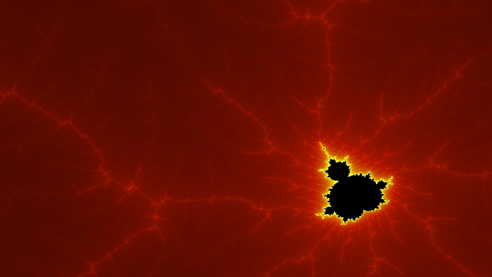
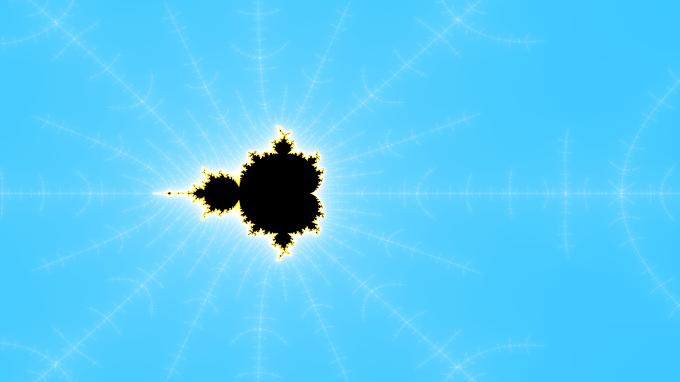
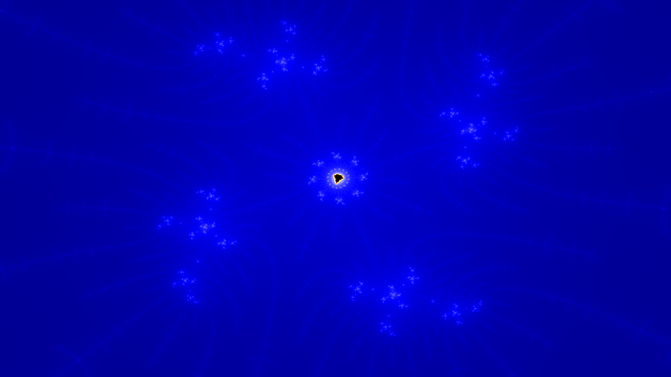
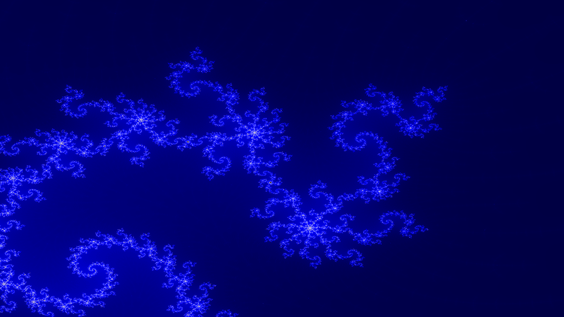
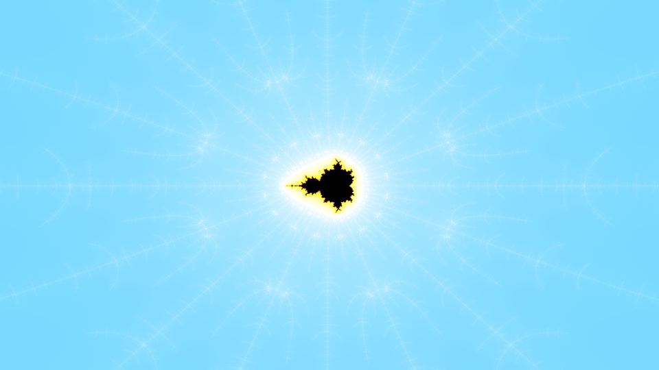
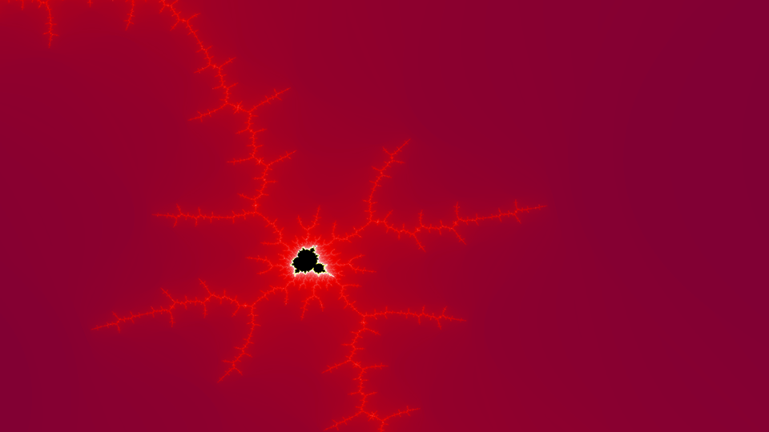

# CLBrot

## 1. Description
CLBrot is a mandelbrot set generator which uses the OpenCL library to do computations on the GPU

## 2. Support
This folder contains two version of the program. CLBrot currently only runs on windows
  32 bits exe CLBrot.exe
  64 bits exe CLBrot(x64).exe

## 3. Install
Extract the program to a directory of your choice and run the install.bat program

## 4. Author
This program is written and maintainted by Hugo Tunius (hugotunius.se)

## 4.1 Credits
+ Freetype http://www.freetype.org 	- Used for text rendering
+ OpenCL   http://www.khronos.org/opencl/ - Opencl
+ Opengl    http://www.opengl.org/  	- Used for drawing
+ Glew	 http://glew.sourceforge.net/ 	- Windows bindings for new opengl versions

## 5. Build
This program has succefully been built with visual studio 2010 and 2011

## 6. License
Copyright (C) 2012 Hugo Tunius
Permission is hereby granted, free of charge, to any person obtaining a copy of this software and associated documentation files (the "Software"),
to deal in the Software without restriction, including without limitation the rights to use, copy, modify, merge, publish, distribute, sublicense,
and/or sell copies of the Software, and to permit persons to whom the Software is furnished to do so, subject to the following conditions:

The above copyright notice and this permission notice shall be included in all copies or substantial portions of the Software.

THE SOFTWARE IS PROVIDED "AS IS", WITHOUT WARRANTY OF ANY KIND, EXPRESS OR IMPLIED, INCLUDING BUT NOT LIMITED TO THE WARRANTIES OF MERCHANTABILITY,
FITNESS FOR A PARTICULAR PURPOSE AND NONINFRINGEMENT. IN NO EVENT SHALL THE AUTHORS OR COPYRIGHT HOLDERS BE LIABLE FOR ANY CLAIM, DAMAGES OR OTHER LIABILITY,
WHETHER IN AN ACTION OF CONTRACT, TORT OR OTHERWISE, ARISING FROM, OUT OF OR IN CONNECTION WITH THE SOFTWARE OR THE USE OR OTHER DEALINGS IN THE SOFTWARE.
